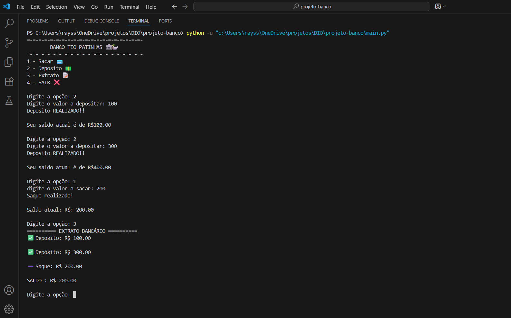

# Projeto para o bootcamp DIO Suzano - Python Developer #2

🏦 Banco Tio Patinhas (Sistema Bancário Simples)

Este projeto é um sistema bancário simples em Python, que permite:
-  Realizar depósitos
- Realizar saques (com limite de saques por dia)
- Exibir o extrato bancário com todas as operações
- Controlar o saldo do cliente

# Exemplo do projeto
  
 

